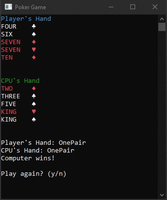

# CS155Project-Poker
> Final Group Project for CS 155 C# and the .NET Framework at  
> [MiraCosta Community College](http://catalog.miracosta.edu/disciplines/computerscience/#courseinventory)

## Screenshot

**Description**
> Simple Poker game simulator on console which automatically draws both the  
> player's and the CPU's hand. The console also immediately prints winning  
> hand based on [`HandEvaluator.cs`](/PokerGame/HandEvaluator.cs).
> User is then asked (using a `while` loop) if they wish to continue or quit.  

**Instructions**
> The theme of this year’s project will be a video game.  Create either a  
> console or WPF GUI game.  Some ideas for this are a quiz show (“Jeopardy”,  
> “Are you Smarter than a 5th Grader”, “Wheel of Fortune”), puzzle game  
> (2048, 8-Puzzle), card games (Poker, Texas Hold-Em, Craps, Yahtzee), etc.  

**Tasks**
> Tasks I wish to implement:  
> [ ] WPF GUI  
> [ ] Texas Hold'em rules  
> [ ] Bet, Hold, Check at each turn  
> [ ] Player's amount of cash  
> [ ] Amount of cash in pot  
> [ ] Top players list  
